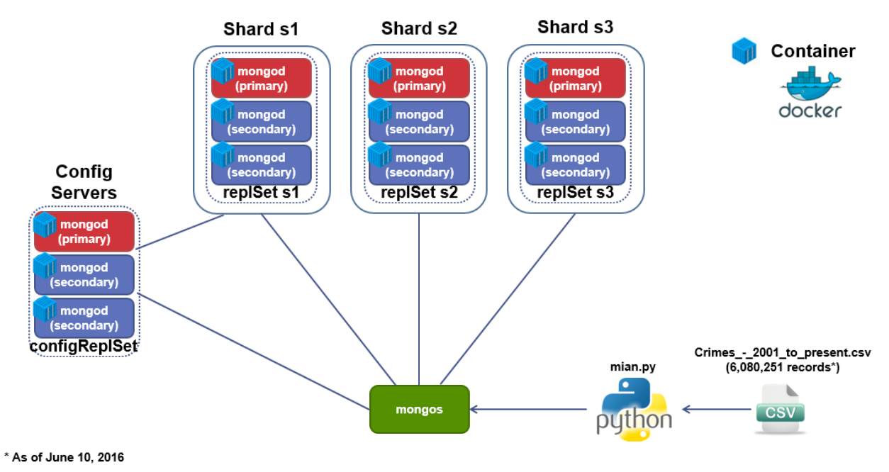

Big data analysis with MongoDB Sharded Cluster (with Docker containers)
=====================================

## Introduction
This repository was created to share my class project. What I did in the project are:
* Use a publically available dataset (I used 1.5GB/6M+ records of CSV file)
* Deploy a MongoDB Sharded Cluster (I used Docker containers to deploy everything in my localmachine)
* Design a schema for data in the database
* Clean and store the data into the database (with python programming)
* Analyze the dataset by querying with MongoDB Aggregation Framework
* Visualize the [results](https://1drv.ms/b/s!AkRAr6rw0sUWgTcS2zot_6jKowM4)

## MongoDB Topology
  

## Requirements  
Other than MongoDB and pymongo, you need to install docker engine and docker compose  
**For OS X:**   
- Install Docker toolbox  
    https://www.docker.com/products/docker-toolbox  

**For Linux:**  
- Install Docker Engine  
    https://docs.docker.com/engine/installation/  

- Install Docker Compose  
    https://docs.docker.com/compose/install/

- Create a Docker group and add your user  
    https://docs.docker.com/engine/installation/linux/ubuntulinux/#create-a-docker-group

        $ sudo groupadd docker
        $ sudo usermod -aG docker USERNAME

## Setup MongoDB sharded cluster with containers
1. Deploy docker containers  
    The pre-defined docker-compose.yml file will automatically deploy 12 containers(mongod) for you

        $ docker-compose up -d

    **Containers to be deployed**  

    Container name      | Hostname        | IP Address      | mongod port      | User      | Password 
    ----                | ---             | ----            | ---              | ---       | ---  
    mongo-S01-R01       | mongo-S01-R01   | 172.31.0.11     | 27018            | mongo     | mongo 
    mongo-S01-R02       | mongo-S01-R02   | 172.31.0.12     | 27018            | mongo     | mongo 
    mongo-S01-R03       | mongo-S01-R03   | 172.31.0.13     | 27018            | mongo     | mongo 
    mongo-S02-R01       | mongo-S02-R01   | 172.31.0.21     | 27018            | mongo     | mongo 
    mongo-S02-R02       | mongo-S02-R02   | 172.31.0.22     | 27018            | mongo     | mongo 
    mongo-S02-R03       | mongo-S02-R03   | 172.31.0.23     | 27018            | mongo     | mongo 
    mongo-S03-R01       | mongo-S03-R01   | 172.31.0.31     | 27018            | mongo     | mongo 
    mongo-S03-R02       | mongo-S03-R02   | 172.31.0.32     | 27018            | mongo     | mongo 
    mongo-S03-R03       | mongo-S03-R03   | 172.31.0.33     | 27018            | mongo     | mongo 
    configSVR-01        | configSVR-01    | 172.31.0.41     | 27019            | mongo     | mongo 
    configSVR-02        | configSVR-02    | 172.31.0.42     | 27019            | mongo     | mongo 
    configSVR-03        | configSVR-03    | 172.31.0.43     | 27019            | mongo     | mongo 

2. Configure each container and start mongos  
    see "MongoDB Sharded Cluster_config.txt" for each config

## Clean and insert data into MongoDB
1. Download the latest dataset(csv) from [here](http://catalog.data.gov/dataset/crimes-2001-to-present-398a4)  
    The data size is about 1.5GB with 6M+ records (As of June 2016), and it is to be updated every week

2. Run main.py

        $ python main.py

    Below is the sample document stored in MongoDB. 

        {
            "_id" : ObjectId("576e21fbb2393b426d57bdc6"),
            "DayOfWeek" : "Tuesday",
            "Category" : {
                "FBI Code" : "18",
                "Primary Type" : "NARCOTICS",
                "IUCR" : "1811",
                "Description" : "POSS: CANNABIS 30GMS OR LESS"
            },
            "Updated On" : ISODate("2016-04-15T08:55:02Z"),
            "Location Description" : "SCHOOL, PUBLIC, BUILDING",
            "Beat" : 2432,
            "Domestic" : "false",
            "Arrest" : "true",
            "Distinct" : "024",
            "Location" : {
                "type" : "Point",
                "coordinates" : [
                    -87.66929687,
                    42.002478396
                ]
            },
            "Community Area" : 1,
            "Year" : 2006,
            "Date" : ISODate("2006-01-31T12:13:05Z"),
            "Ward" : 40,
            "Case Number" : "HM155213",
            "ID" : 4647369,
            "Block" : "066XX N BOSWORTH AVE"
        } 

> It will take about 20 to 40 minues depending on your machine resources

## Enable sharding
1. Create an index for shard-key
    
        $ mongo
        mongos> use chicago
        mongos> db.crimes.createIndex({  YOUR SHARD KEY  })

2. enable sharding on the database and on the collection    

        mongos> sh.enableSharding("chicago")
        mongos> sh.shardCollection("chicago.crimes", {  YOUR SHARD KEY  })

> It could take several hours to complete the chunk migration

## Execute your queries

You may want to add other indexes depending on your queries.   
For your reference, please see [here](https://1drv.ms/b/s!AkRAr6rw0sUWgTcS2zot_6jKowM4) for sample queries and results.

